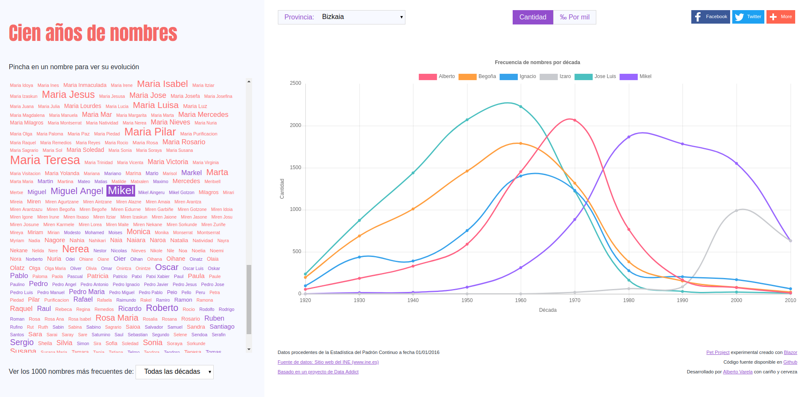

# Nombres

[](https://opensource.org/licenses/Apache-2.0)

[](https://hub.docker.com/r/artberri/nombres/)

**Data Visualization WebApp of 100 years of Spanish first names.**

*Disclaimer: This is a "pet project" and could be abandoned at any time.*



A simple example of how [Blazor](https://github.com/aspnet/Blazor), an experimental web UI framework running client-side via WebAssembly, can be used to build single page applications against an API, share code with it or execute JS code from C#.

## Docker Image

"Nombres" has not been deployed to any server yet. For now, the only way to demo it is using the image available on docker hub at [artberri/nombres](https://hub.docker.com/r/artberri/nombres/). To pull the latest version of the image, run the following command:

```bash
docker pull artberri/nombres
```

To run the image, exec the following command:

```bash
docker run -it --rm -p 8080:5000 artberri/nombres
```

After running above command see the web at [http://localhost:8080](http://localhost:8080)

## Requirements

The following software needs to be installed:

- [.NET Core 2.1 RC1 SDK](https://www.microsoft.com/net/download/dotnet-core/sdk-2.1.300-rc1)
- [Visual Studio Code](https://code.visualstudio.com/)

To make the development more fun, this project has been done under Linux :P

## Building and Running the Project

### Running and Debugging the Web API

Open the project in Visual Studio Code and hit Ctrl+F5 (or just F5) to start the .NET Core API.

If running from the command line:

```bash
dotnet run --project src/Names.API/Names.API.csproj
```

### Running the Web App

Run in the command line:

```bash
dotnet run --project src/Names.Web/Names.Web.csproj
```

### Running all with Docker Compose

This project has a `docker-compose.yml` file that will help you running the project locally.

```bash
docker-compose up --build
```

## To Do List

- Create PWA
- Allow to search more names
